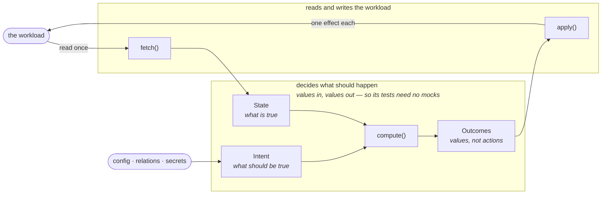
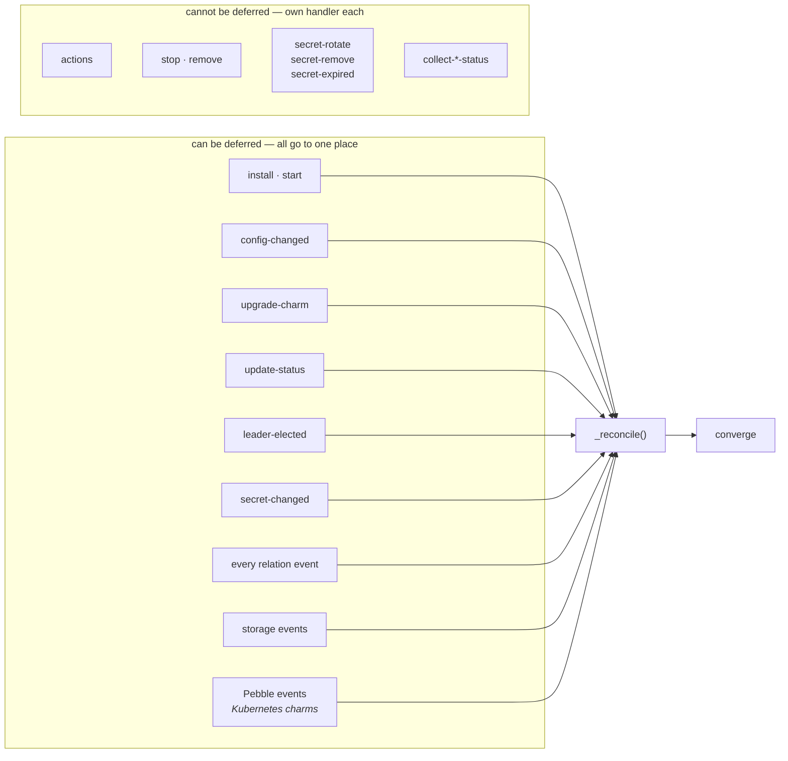

# How this charm decides what to do

This charm is built as a **reconciler**. This document explains what that means
and how the code is arranged. It uses a small example that has nothing to do with
Pi-hole, so you can learn the shape first.

The decision to build it this way, and the options we rejected, are in
[ADR-0003](adr/0003-reconciler-and-functional-core.md). This document explains
the shape. That one explains the choice.

---

## 1. The problem

A charm is not an install script. Four facts about how Juju runs a charm force
the design.

1. **A hook runs once and then exits.** No process stays alive between events.
   Every hook starts with nothing and has to work out what to do by looking at
   the workload.
2. **You will miss events.** A unit can be down. A hook can fail. A relation can
   change while your unit is not running. So any code that runs on one event only
   is code that will sometimes not run at all.
3. **Events arrive more than once.** `config-changed` fires on install, on
   upgrade, and every time someone changes config. Code that breaks when it runs
   twice will break.
4. **The workload may lie.** Package managers, service managers and command-line
   tools often return success for work they did not do. An exit code is a claim.
   It is not proof.

Facts 2 and 3 have one answer. Do not ask "what just happened?". Ask "what is
true now, and what should be true?". Then close the gap. Fact 4 has another
answer. After you change something, read it back.

So there are two questions to ask about every piece of code you write here. Both
answers must be "nothing":

- What breaks if this runs twice?
- What breaks if this never runs?

---

## 2. How the code is split

The charm is split in two parts, and the split is the main idea.

- One part **decides** what should happen. It only works with plain values. It
  never reads or writes the workload, because it does not import anything that
  can.
- The other part **reads and writes the workload**. It contains no decisions at
  all. It only translates: the workload into values on the way in, and values into
  effects on the way out.

The part that decides is small and easy to test, because a test only has to build
values and check the values that come back. The part that touches the workload is
kept thin and boring on purpose, because that is the part a test cannot check
cheaply. In this charm the whole of it is `_apply`: 25 lines of `match`, one call
per branch, and no `if` anywhere.

**This is also the only part that differs between a machine charm and a
Kubernetes charm.** The two halves are the same shape in both, and the deciding
half is identical:

| | A machine charm | A Kubernetes charm |
|---|---|---|
| Install the workload | `snap`, `apt` | already in the OCI image |
| Run a command | `subprocess` | `container.pebble.exec` |
| Read or write a file | `pathlib` | `container.pull`, `container.push` |
| Start or stop a service | `systemd`, `snap start` | a Pebble layer, `container.replan` |
| Check it is running | read real state and verify | `container.get_service`, plus verify |

This charm is a machine charm, so the examples below use a snap. If you are
writing for Kubernetes, replace those calls with Pebble ones and change nothing
else. `Intent`, `State`, `Outcome`, `fetch` and `compute` do not know or care
which kind of charm they are in, because they never touch the workload at all.
That portability is a direct result of the split, not an extra feature.

Three kinds of value cross the line between the two parts:

| Value | Answers | Example |
|---|---|---|
| **Intent** | What *should* be true. Built from config, relations and secrets. | "retention is 15d" |
| **State** | What *is* true. One read of the workload, frozen. | "the snap is not installed" |
| **Outcome** | What to *do* about the difference. A value, not an action. | `Install()`, `SetRetention("15d")` |

And three functions do the work:

| Function | Reads? | Writes? | Job |
|---|---|---|---|
| `fetch` | yes | no | Collect every fact the decision needs, in **one** pass |
| `compute` | no | no | Compare state to intent. Return an ordered list of outcomes |
| `apply` | no | yes | Perform one outcome. Contains no decisions |



Notice that it is a **loop**, and that is the whole point. `apply` changes the
workload. The next event reads the workload again. This time `compute` finds
nothing left to do. That is what "converge" means.

The event handler is then the loop itself:

```python
# src/charm.py
def _reconcile(self, _: ops.EventBase) -> None:
    intent = Intent(retention=self.config["retention"])  # config, relations, secrets
    state = fetch(self._workload)                        # the only read
    for outcome in compute(state, intent):
        self._apply(outcome)
```

`Intent` and the two functions are the ones defined in the example in the next
section. Notice where each side comes from: the intent is built from Juju — config,
relations, secrets — and the state from the workload. Neither is built from the
other.

That is the shape, not a copy of this charm's code. A real reconciler adds two
things to it: a guard for when the intent cannot be built yet, and a way to report
a failure that the status handler could not have worked out on its own. The
[reading path in the README](../README.md#reading-this-charm-as-an-example) goes
to the real one.

Most of the events you observe go here. There is no separate handler for any one
of them, because none of them tells you enough to act on by itself.
`config-changed` does not tell you *which* config key changed. `relation-changed`
does not tell you *how* the relation data changed. So all any of them really
means is "the workload may have changed, go and look". In this charm, seven events
are routed this way.

The rest get a handler of their own, and the rule for which ones is not a matter
of taste. **An event that cannot be deferred needs its own handler.** Deferring is
how a reconciler says "not yet", and these events have no later: an action has to
answer now, `remove` is the last chance to clean up, a `secret-remove` event is
the only place the revision to drop is available, and a status hook must not
change anything. In this charm there are four of them.

This is the official guidance, where the approach is called **holistic** (as
opposed to **delta**, which gives every event its own handler): see
[Holistic vs delta charms](https://canonical.com/juju/docs/ops/latest/explanation/holistic-vs-delta-charms/)
in the `ops` documentation. That page is also honest about the trade-off, and so is
this one: it notes that simple workloads are often served well by delta charms,
and that machine charms map to the delta model more readily than Kubernetes
charms. We use the reconciler here because this workload lies about what it did,
so every operation has to be re-checked anyway, and re-checking everything is
exactly what a reconciler already does.



Look at `update-status` in the left group. It fires on a timer and carries no
information at all. That makes it a good test of the design. If the reconciler is
correct, then a regular "go and look again" is enough to repair any difference,
including one caused by an event you missed.

---

## 3. A small example

Here is a charm for a Prometheus snap with one setting. It is about forty
lines and it has every part of the pattern.

It lives in three files, and the split between them is the design:

| File | Holds | Never imports |
|---|---|---|
| `src/prometheus_state.py` | `Intent`, `State`, `Outcome`, the `Facts` protocol, `fetch`, `compute` | `ops`, and the workload file |
| `src/prometheus.py` | the class that implements `Facts` and performs the effects | `ops` |
| `src/charm.py` | `_reconcile`, `_apply`, status reporting | `subprocess`, and anything that writes a file |

The "never imports" column is the part that matters, and it is mechanically
checkable: grep the import block. `prometheus_state.py` importing the workload is
what would make its tests need mocks, and `charm.py` importing `subprocess` is what
would put an effect outside `_apply`. Each code block is labelled with the file it
belongs in.

### The three kinds of value

```python
# src/prometheus_state.py
from dataclasses import dataclass
from typing import Protocol, assert_never, final


@final
@dataclass(frozen=True)
class Intent:
    """What the operator asked for."""

    retention: str


@final
@dataclass(frozen=True)
class Absent:
    """The snap is not installed. It has no fields, because nothing else is known yet."""


@final
@dataclass(frozen=True)
class Present:
    """Installed. These fields exist only because it is installed."""

    retention: str
    running: bool


type State = Absent | Present
```

Look at what `Absent` does **not** have. The easy version of this is one class
with `installed: bool` and `retention: str | None`. That version lets you build
`installed=False, retention="15d"`, which is a state that cannot happen. The
type checker will accept it, and every place that uses the value then needs a
`cast()`. Writing it as two classes means the impossible state cannot be built at
all.

```python
# src/prometheus_state.py, continued
@final
@dataclass(frozen=True)
class Install:
    pass


@final
@dataclass(frozen=True)
class SetRetention:
    value: str


@final
@dataclass(frozen=True)
class Start:
    pass


@final
@dataclass(frozen=True)
class Noop:
    pass


type Outcome = Install | SetRetention | Start | Noop
```

An outcome is a thing, not an act. `SetRetention("15d")` is a value. You can
compare it, log it, put it in a list, and check it in a test, and nothing
happens to the workload.

### Where the reading happens

`fetch` has to read the workload. But the file that holds `compute` must not
import anything that touches it. If it does, you can no longer test
`compute` without mocks. A `Protocol` solves this: `compute`'s file describes the
reads it needs, and never imports the code that performs them.

```python
# src/prometheus_state.py, continued
class Facts(Protocol):
    """The reads `fetch` needs. The real workload implements it, and so does a test stub."""

    def installed(self) -> bool: ...
    def retention(self) -> str: ...
    def running(self) -> bool: ...


def fetch(facts: Facts) -> State:
    """Read every fact the decision needs, exactly once."""
    if not facts.installed():
        return Absent()
    return Present(retention=facts.retention(), running=facts.running())
```

This is the only place that reads. If a second function starts reading the
workload, the split is broken, and the tests will need mocks again.

Notice that `fetch` takes only `Facts`, not the intent. That is the shape to aim
for: reading what is true should not need to know what should be true.

**There is one case where it does, and this charm has it.** Sometimes a workload
gives you no way to observe a fact on its own, and the only way to learn it is to
offer a candidate answer and see what the workload says. Pi-hole's admin password
is like that: the stored hash is salted, so it changes on every write even for the
same password, and there is nothing to compare it against. The only way to ask "is
this the right password" is to try it against the API.

So the real `fetch` in this charm takes the intent as well:

```python
def fetch(pihole: PiholeFacts, intent: PiholeIntent) -> PiholeState: ...
```

Be honest about what that costs. The password field on the resulting state is no
longer a plain observation. It is the answer to a comparison, and it is only
meaningful for *that* intent. If you do this, say so where the reader will see it,
and keep it to the facts that genuinely cannot be read any other way. Everything
else in `fetch` should still be a plain read.

### The decision

```python
# src/prometheus_state.py, continued
def compute(state: State, intent: Intent) -> tuple[Outcome, ...]:
    """Decide what to do. No reading, no writing, and no exceptions for control flow."""
    match state:
        case Absent():
            # The order matters for correctness, so it is written down once, here.
            return (Install(), SetRetention(intent.retention), Start())
        case Present():
            outcomes: list[Outcome] = []
            if state.retention != intent.retention:
                outcomes.append(SetRetention(intent.retention))
            if not state.running:
                outcomes.append(Start())
            return tuple(outcomes) or (Noop(),)
        case _ as unreachable:
            assert_never(unreachable)
```

**This function is the charm's specification.** Everything the charm does is
here, in one place, with no snap, no `subprocess` and no `ops`. You can read it
and know the behaviour. You can test it with plain `pytest` and no mocks.

### Performing the outcomes

```python
# src/charm.py
def _apply(self, outcome: Outcome) -> None:
    """Perform one outcome that was already decided. Deliberately dull."""
    match outcome:
        case Install():
            self._workload.install()
        case SetRetention(value=value):
            self._workload.set_retention(value)
        case Start():
            self._workload.start()
        case Noop():
            pass
        case _ as unreachable:
            assert_never(unreachable)
```

One `match`, one call per branch, no `if` and no arithmetic. If you find yourself
deciding something here, it belongs in `compute`.

### If you know Prometheus as a Kubernetes charm

The example above installs a snap, because this repo is a machine charm. On
Kubernetes the same charm has the same shape, and only the outer half changes:

- There is nothing to install — the workload is already in the OCI image — so the
  `Install` outcome disappears.
- `Absent` and `Present` stop meaning "installed" and start meaning "the container
  is reachable": `Absent` is `container.can_connect()` returning `False`.
- `SetRetention` writes a Pebble layer or pushes a config file with
  `container.push`, instead of calling `snap set`.
- `Start` becomes `container.replan()`.
- `Facts.running()` reads `container.get_service(...).is_running()`.

`Intent`, `State`, `Outcome` and `compute` are untouched. That is the claim from
the table in section 2, and this is what it looks like in practice: the deciding
half does not know which kind of charm it is in.

---

## 4. What you get, and what gives it to you

| What you get | How |
|---|---|
| A new case cannot be forgotten in silence | `assert_never` at the end of every `match`. Add a variant to a union and both `compute` and `_apply` fail the type checker, by file and line. Without it, `_apply` would return `None`, and the charm would report success while skipping the new outcome. |
| Decisions can be tested without mocks | `compute` only uses values. Build a `State`, build an `Intent`, check the tuple that comes back. |
| Reads can be tested without the workload | The `Facts` protocol has two implementations: the real workload, and a stub in the tests. |
| The order of steps can be reviewed | The install order is a literal tuple in one function. It is not something that emerges from the order events happen to arrive in. |
| Impossible states do not compile | Each field lives on the class that can actually have it. |

The clearest warning sign: **if a test needs a mock to reach a decision, the
split is broken somewhere above it.**

---

## 5. Three ways to break it

**Deciding and acting in the same function.** A function that performs an effect
*and* returns a value describing what it decided cannot be tested without
performing the effect. Split it in two. One function returns the outcome. Another
performs it.

**A boolean argument that turns effects on and off.** If one caller passes
`f(generate=True)` and another passes `f(generate=False)`, then the name of the
function can no longer tell you whether it changes anything. The guarantee now
lives in an argument instead of in the type. Write two functions, and let each
name answer the question.

**Believing a return code.** Calling an operation is not proof that the operation
happened. Read back the state it was supposed to produce. This is cheap, because
`fetch` on the next event does exactly that, and `compute` will simply decide to
do the work again.

---

## 6. The same thing in this charm

The [reading path in the README](../README.md#reading-this-charm-as-an-example)
walks through the same five parts in real code, where the workload lies and the
pattern has to earn its place.

| In the example above | In this charm |
|---|---|
| `Intent` | `PiholeIntent` in [`src/pihole_state.py`](../src/pihole_state.py) |
| `State` | `PiholeState`, which is `SnapAbsent \| SnapPresent` |
| `Outcome` | `PiholeOutcome`, with seven variants |
| `Facts` | `PiholeFacts`, implemented by `Pihole` and by `FactsStub` in the tests |
| `fetch` | `fetch`, which also takes the intent — see the note above |
| `compute` | `compute`, which calls `_bootstrap` or `_converge` |
| `_apply` | `_apply` in [`src/charm.py`](../src/charm.py) |

There is a longer walkthrough of the deciding half, including the edge cases the
types encode, in
[`docs/implementation/pihole_state.md`](implementation/pihole_state.md).
